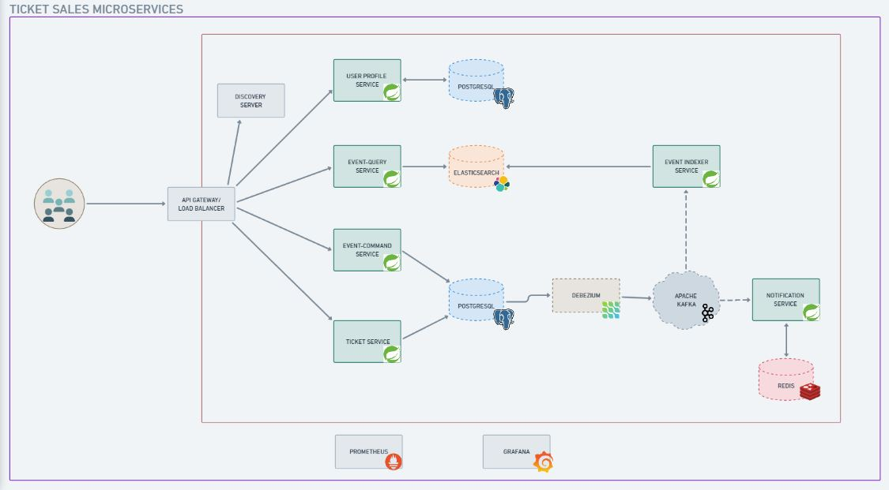
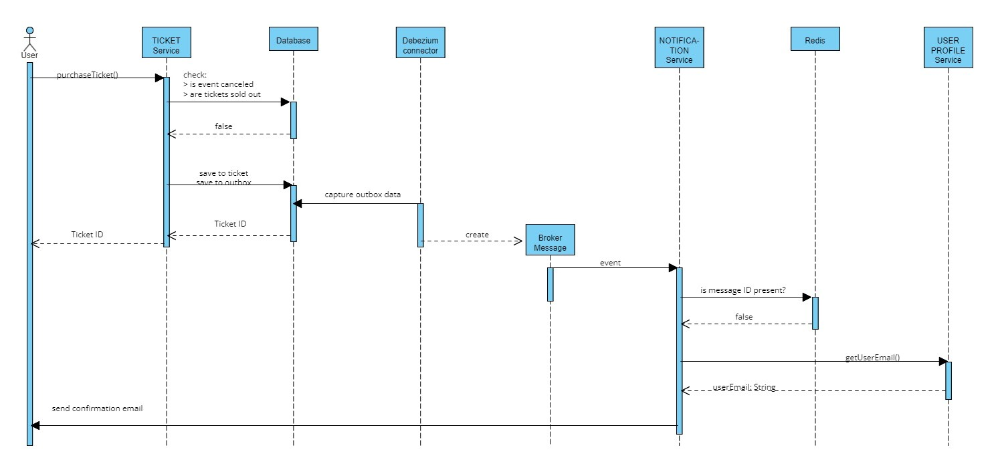
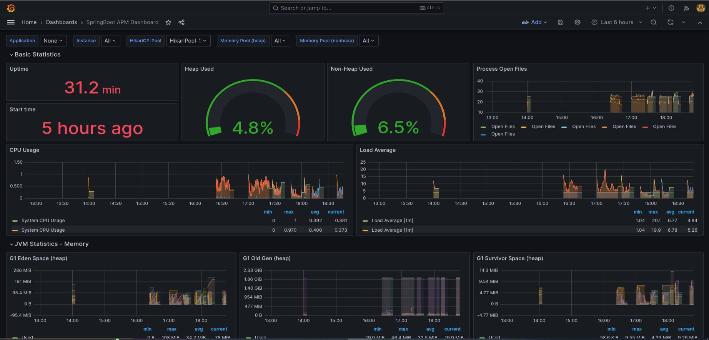
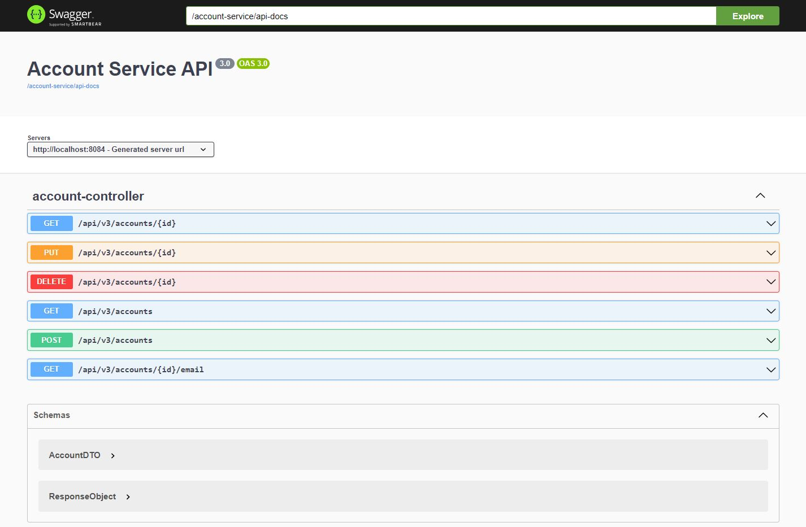

         

# TICKET SALES MICROSERVICES
_Organize events and purchase tickets from different services._

| Links | Description | 
|-------|-------------|
| [](https://github.com/gestanestle/ticket-sales-microservices/tree/v2.0) | Backend - v2.0 |
| [](https://github.com/gestanestle/ticket-sales-microservices/tree/v1.0) | Backend - v1.0 |

### Technologies
Ticket Sales Microservices uses a number of tools and frameworks to work properly:

- Java, PostgreSQL, Redis, Elasticsearch
- Spring Boot - Web, Actuator
- Spring Cloud - Eureka Server/Client, API Gateway
- Spring 5 WebFlux - WebClient
- Spring Data JPA, Spring JDBC, Flyway
- Spring Data Redis, Jedis
- Java API Client for Elasticsearch
- JUnit, Mockito, MockMVC, Test Containers
- Java Mail Sender, Gmail SMTP
- Apache Kafka, Zookeeper
- Debezium
- Docker, Docker Compose
- Prometheus
- Grafana
- Swagger

## THE ARCHITECTURE



Ticket Sales Microservices is a backend system that lets you:
* Create, update, and delete events
* Set ticket details for the created events
* Search and purchase ticket for events

_A fairly simple application in a distributed architecture._

### Event-Driven and Change Data Capture

This ticket sales system is based on event-driven paradigm, utilizing Apache Kafka as the message broker. 
It is not the applications themselves that directly publish the records to Kafka but Debezium - 
a third party CDC tool that captures row-level changes in our source database (PostgreSQL). 
It guarantees at-least once delivery semantics for every message.

**Debezium + Kafka act as a streaming pipeline to pass data to other services.** <br>
<br>
In our microservices, this pipeline is being used for two distinct purposes:  
* To sync the data between read and write models for entity ```Event``` 
* To send the appropriate data needed to process notifications upon ```Ticket``` Purchase

> _Note that ```Event``` here refers to the aggregate root - the main entity this entire system 
> cannot live without. This must not be confused with the term **domain events**._

### Command and Query Responsibility Segregation

Commands and queries for ```Event``` are separated. Addition of new ```Event```, modification, and deletion
are done through ```Event Command```. On the other hand, querying events - searching per keyword and getting per ID -
can only be done through ```Event Query```.

Elasticsearch, a distributed search engine, is used to create a highly available read model with 
Full-Text Search capabilities. The write model is PostgreSQL, a relational database with transactional properties.
Debezium captures every row-level change in ```event``` table and publishes it to the topic ```event_ticket_db.public.event``` 
in Kafka. ```Event Indexer``` listens to the topic and inserts the records to the appropriate index in Elasticsearch. 

### The Outbox Pattern

Accommodating ticket purchase requests is decoupled from sending out notifications to the users upon successful ticket purchases.
The application ```Ticket``` does the former while ```Notification``` does the latter. Saving the users' details to the ```outbox``` table
is part of the entire unit of work done against the database. Debezium captures every change in ```outbox``` table and publishes it
to the topic ```outbox.event.ticket_purchase```. ```Notification``` subscribes to it and caches the messages to Redis. 
The sequence diagram is given below.



### Shared Database
Event Management and Ticket Sales are the two main contexts of this application. Services ```Event Command``` and ```Ticket``` share 
some data needed to be able to operate successfully. It follows a microservices pattern called 'shared database', 
with whose objects are set with fine-grained access privileges accordingly.

### Database Migration
While the API layer used for Hibernate are Spring Data JPA and Spring JDBC, the DDL, unlike the previous version, is set to 'update'. 
The schema creation, versioning, and migrations are all managed by Flyway.

### Testing
The services ```Event Command```, ```Ticket``` , and ```Notification``` are unit-tested with JUnit, Mockito, and MockMVC, and DB-integration tested with Test Containers.

### Monitoring



Spring Boot Actuator exposes the metrics of each services, including the API Gateway and Discovery Server, while a 
third-party exporter exposes the metrics of the database. Prometheus scrapes these, serving as data sources to Grafana, 
which then visualizes the data in the dashboards. The endpoints are accessible through ports 9090 and 3000, respectively.

## RUNNING THE APPLICATIONS

Navigate to the root directory and start the containers.
```
docker compose up -d
```

Upon verifying that the containers are up and running, run the shell script that does the following:
* Creates an index ```events``` in elasticsearch
* Creates separate roles with read and write privileges
* Creates users for ```Event Indexer``` and ```Event Query``` with their corresponding roles
* Registers the debezium/kafka connectors for change data capture

```
./start.sh
```

### Service dependency to be considered
The properties [ ```created by``` ] in Event Service and [ ```purchased by``` ] in Ticket Service refer to the auto-generated 
User ID in ```User Profile```. To be able to organize events and purchase tickets, the user has to be present in the database 
first. Create a profile with the necessary fields in the URL given below. To learn more, see API Documentation.
```
http://localhost:9000/api/v2/user-profiles 
```

> _Due to the absence of a proper Auth Service, this application assumes that any email addresses provided by the users are verified. When creating events and purchasing tickets, **proceed with caution**._

### API Documentation
The services User Profile, Event, and Ticket have their own OpenAPI specifications. To access the API Docs, go to the following URLs:

```
http://localhost:9000/api/v2/user-profiles/swagger/ui
```
```
http://localhost:9000/api/v2/event-command/swagger/ui
```
```
http://localhost:9000/api/v2/event-query/swagger/ui
```
```
http://localhost:9000/api/v2/tickets/swagger/ui
```

For Ticket Service, it will be as follows: </br>




## Project Tree
```bash
.
├───.github
│   └───workflows
├───.idea
├───api-gateway
│   └───src
│       └───main
│           ├───java
│           │   └───com
│           │       └───krimo
│           │           └───gateway
│           └───resources
├───connectors
├───eureka
│   └───src
│       └───main
│           ├───java
│           │   └───com
│           │       └───krimo
│           │           └───eureka
│           └───resources
├───event-command
│   └───src
│       ├───main
│       │   ├───java
│       │   │   └───com
│       │   │       └───krimo
│       │   │           └───event_command
│       │   │               ├───config
│       │   │               ├───controller
│       │   │               ├───data
│       │   │               ├───dto
│       │   │               ├───exception
│       │   │               ├───repository
│       │   │               └───service
│       │   └───resources
│       │       ├───db
│       │       │   └───migration
│       │       └───static
│       └───test
│           └───java
│               └───com
│                   └───krimo
│                       └───event_command
│                           ├───controller
│                           ├───data
│                           └───service
├───event-indexer
│   └───src
│       └───main
│           ├───java
│           │   └───com
│           │       └───krimo
│           │           └───event_indexer
│           │               ├───config
│           │               ├───payload
│           │               └───service
│           └───resources
├───event-query
│   └───src
│       └───main
│           ├───java
│           │   └───com
│           │       └───krimo
│           │           └───event_query
│           │               ├───config
│           │               ├───controller
│           │               ├───data
│           │               ├───exception
│           │               └───service
│           └───resources
│               └───static
├───grafana
│   ├───dashboards
│   └───datasources
├───notification
│   └───src
│       ├───main
│       │   ├───java
│       │   │   └───com
│       │   │       └───krimo
│       │   │           └───notification
│       │   │               ├───config
│       │   │               ├───exception
│       │   │               ├───message
│       │   │               │   └───payload
│       │   │               ├───repository
│       │   │               └───service
│       │   └───resources
│       └───test
│           └───java
│               └───com
│                   └───krimo
│                       └───notification
│                           ├───repository
│                           └───service
├───postgres
│   └───init
├───prometheus
├───static
├───ticket
│   └───src
│       ├───main
│       │   ├───java
│       │   │   └───com
│       │   │       └───krimo
│       │   │           └───ticket
│       │   │               ├───config
│       │   │               ├───controller
│       │   │               ├───dao
│       │   │               ├───data
│       │   │               ├───dto
│       │   │               ├───exception
│       │   │               ├───payload
│       │   │               ├───repository
│       │   │               ├───service
│       │   │               └───utils
│       │   └───resources
│       │       ├───db
│       │       │   └───migration
│       │       └───static
│       └───test
│           └───java
│               └───com
│                   └───krimo
│                       └───ticket
│                           ├───config
│                           ├───container
│                           ├───controller
│                           ├───dao
│                           ├───data
│                           ├───repository
│                           └───service
└───userprofile
    └───src
        ├───main
        │   ├───java
        │   │   └───com
        │   │       └───krimo
        │   │           └───userprofile
        │   │               ├───config
        │   │               ├───controller
        │   │               ├───domain
        │   │               ├───dto
        │   │               ├───repository
        │   │               └───service
        │   └───resources
        │       ├───db
        │       │   └───migration
        │       └───static
        └───test
            └───java
                └───com
                    └───krimo
                        └───userprofile

```

